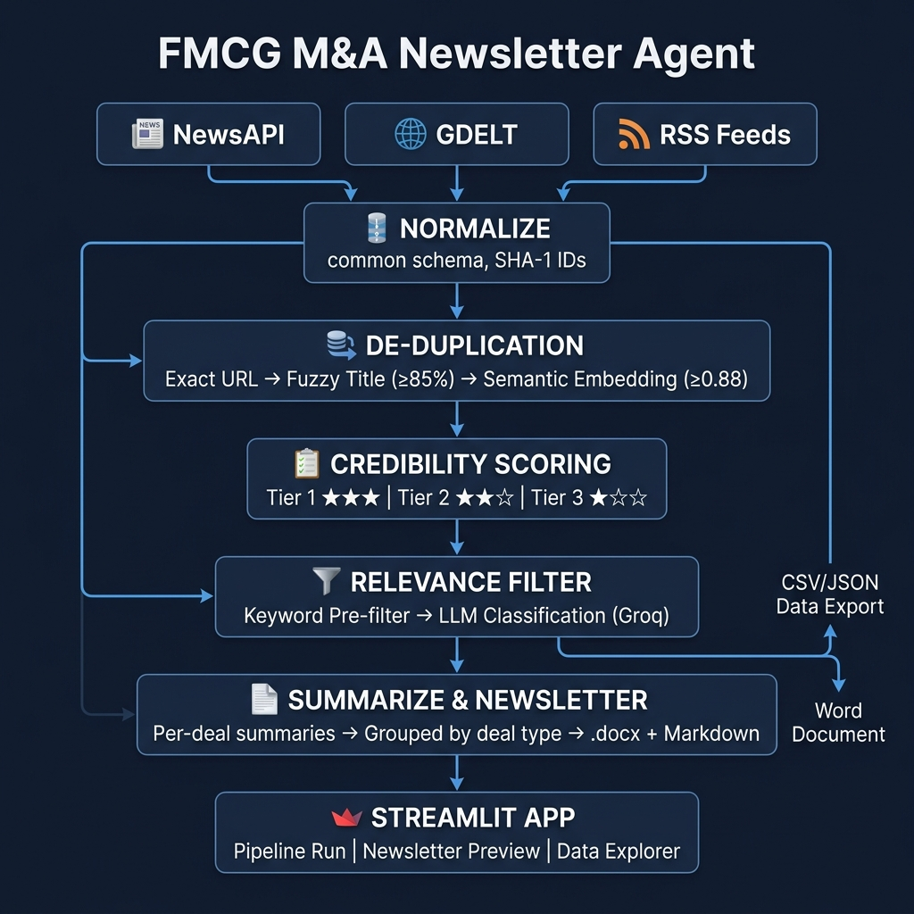

# FMCG M&A Newsletter Agent

> Automated FMCG deal intelligence — from raw news to boardroom-ready newsletter in minutes.

An AI-powered pipeline that aggregates, de-duplicates, scores, and summarizes FMCG (Fast-Moving Consumer Goods) merger & acquisition news into a concise, structured newsletter. Built as an assignment for **Benori Knowledge Solutions**.



---

## 🎯 What It Does

This agent automates the creation of an FMCG industry intelligence newsletter by:

1. **Aggregating** deal-related news from multiple public sources (NewsAPI, GDELT, RSS feeds)
2. **Removing** duplicate and near-duplicate coverage of the same deal
3. **Filtering** for relevance to FMCG mergers, acquisitions, and investments
4. **Scoring** source credibility using a tiered domain whitelist
5. **Summarizing** each deal into concise, business-reader-friendly language
6. **Generating** a structured newsletter in both Markdown and Word (.docx) format

---

## 🏗️ Architecture

```
┌─────────────────────────────────────────────────────────────────────┐
│                        DATA SOURCES                                 │
│   ┌──────────┐    ┌──────────┐    ┌──────────────────────────────┐  │
│   │ NewsAPI   │    │ GDELT    │    │ RSS Feeds                    │  │
│   │ (100/day) │    │ (free)   │    │ (ET, Mint, BS, MC, NDTV)    │  │
│   └────┬─────┘    └────┬─────┘    └──────────────┬───────────────┘  │
│        │               │                          │                  │
│        └───────────────┼──────────────────────────┘                  │
│                        ▼                                             │
│              ┌─────────────────┐                                     │
│              │   NORMALIZE     │  Common schema, SHA-1 IDs           │
│              └────────┬────────┘                                     │
│                       ▼                                              │
│   ┌───────────────────────────────────────────────────────────────┐  │
│   │                 DE-DUPLICATION (3 layers)                      │  │
│   │  Layer 1: Exact URL match (canonical URL → SHA-1)             │  │
│   │  Layer 2: Fuzzy title (rapidfuzz, threshold ≥ 85%)            │  │
│   │  Layer 3: Semantic (sentence-transformers, cosine ≥ 0.88)     │  │
│   └───────────────────────┬───────────────────────────────────────┘  │
│                           ▼                                          │
│   ┌───────────────────────────────────────────────────────────────┐  │
│   │               CREDIBILITY SCORING                             │  │
│   │  Tier 1 (★★★): Reuters, Bloomberg, ET, Mint, BS              │  │
│   │  Tier 2 (★★☆): Moneycontrol, TechCrunch, Forbes              │  │
│   │  Tier 3 (★☆☆): Unknown / niche sources                       │  │
│   └───────────────────────┬───────────────────────────────────────┘  │
│                           ▼                                          │
│   ┌───────────────────────────────────────────────────────────────┐  │
│   │              RELEVANCE FILTERING (2 stages)                   │  │
│   │  Stage 1: Keyword pre-filter (FMCG entity + deal term)       │  │
│   │  Stage 2: LLM classification (Groq Llama 3.1, conf ≥ 0.6)   │  │
│   └───────────────────────┬───────────────────────────────────────┘  │
│                           ▼                                          │
│   ┌───────────────────────────────────────────────────────────────┐  │
│   │              SUMMARIZATION & NEWSLETTER                       │  │
│   │  Per-deal 2-3 sentence summaries (LLM)                       │  │
│   │  Grouped by deal type with executive summary                  │  │
│   │  Output: Markdown + Word (.docx)                              │  │
│   └───────────────────────────────────────────────────────────────┘  │
│                                                                      │
│   ┌───────────────────────────────────────────────────────────────┐  │
│   │                    STREAMLIT APP                               │  │
│   │  Tab 1: Pipeline Run (funnel metrics + charts)                │  │
│   │  Tab 2: Newsletter Preview (read + download)                  │  │
│   │  Tab 3: Raw Data Explorer (filter + download CSV/JSON)        │  │
│   └───────────────────────────────────────────────────────────────┘  │
└─────────────────────────────────────────────────────────────────────┘
```

---

## 📋 Pipeline Explanation

### 1. Ingestion
The pipeline pulls articles from three complementary sources:
- **NewsAPI** — structured search with FMCG entity + deal keyword queries (free tier: 100 req/day, 30-day lookback)
- **GDELT Doc 2.0** — global news monitoring filtered by economic themes (mergers/acquisitions) + FMCG keywords (no API key needed)
- **RSS Feeds** — curated business feeds (ET Retail, Mint, Business Standard, Moneycontrol, NDTV Profit) with client-side keyword filtering

All articles are normalized into a common schema with URL-based SHA-1 IDs for consistent dedup.

### 2. De-duplication (3 layers)
Duplicate detection uses a layered approach, from cheapest to most compute-intensive:

| Layer | Method | Threshold | What It Catches |
|-------|--------|-----------|-----------------|
| 1 | Exact URL match | SHA-1(canonical_url) | Same article from same source |
| 2 | Fuzzy title | `rapidfuzz.token_sort_ratio ≥ 85%` | Syndicated articles with minor edits |
| 3 | Semantic | `sentence-transformers cosine ≥ 0.88` | Paraphrased/rewritten coverage |

All comparisons are scoped within a **72-hour publication window** to avoid false positives between unrelated articles published far apart. Within each duplicate cluster, the article from the **highest-credibility source** is kept.

### 3. Relevance Filtering (2 stages)
- **Stage 1 (keyword pre-filter):** Zero-cost check — article must mention ≥1 FMCG entity/sector term AND ≥1 deal keyword. Rejects obvious non-matches without an LLM call.
- **Stage 2 (LLM classification):** Surviving articles are classified by Groq (Llama 3.1) with a structured JSON output prompt. Returns `is_fmcg_deal`, `deal_type`, `companies_involved`, and `confidence` score. Articles below 0.6 confidence are marked `low_confidence`.

### 4. Credibility Scoring
Static domain whitelist mapping ~30 known publications to three tiers:
- **Tier 1 (score 1.0):** Major financial press (Reuters, Bloomberg, ET, Mint, Business Standard)
- **Tier 2 (score 0.7):** Reputable industry sources (Moneycontrol, Forbes, TechCrunch)
- **Tier 3 (score 0.4):** Unknown or niche sources

### 5. Newsletter Generation
- Per-deal summaries generated by LLM (2-3 business-prose sentences each)
- Deals grouped by type: Acquisitions, Mergers, Funding Rounds, Divestments, etc.
- Executive summary auto-generated at the top
- Dual output: Markdown (for in-app preview) + Word .docx (downloadable deliverable)

---

## 🚀 Setup & Installation

### Prerequisites
- Python 3.11+
- [NewsAPI key](https://newsapi.org/) (free tier)
- [Groq API key](https://console.groq.com/) (free tier)

### Local Setup

```bash
# Clone the repository
git clone https://github.com/Somesh-Mishra-9/FMCG-M-A-Newsletter-Agent-.git
cd FMCG-M-A-Newsletter-Agent-

# Create virtual environment
python -m venv venv
source venv/bin/activate  # On Windows: venv\Scripts\activate

# Install dependencies
pip install -r requirements.txt

# Set up environment variables
cp .env.example .env
# Edit .env with your API keys

# Run the Streamlit app
streamlit run app.py
```

### Environment Variables

| Variable | Required | Description |
|----------|----------|-------------|
| `NEWSAPI_KEY` | Yes | API key from newsapi.org |
| `GROQ_API_KEY` | Recommended | API key from Groq (falls back to keyword-only mode without it) |

---

## 📦 Project Structure

```
fmcg-newsletter-agent/
├── README.md                  # This file
├── architecture.png           # Pipeline architecture diagram
├── requirements.txt           # Python dependencies
├── .env.example               # Environment variable template
├── config.py                  # Entity lists, thresholds, API config
├── ingestion/
│   ├── newsapi_source.py      # NewsAPI fetcher
│   ├── gdelt_source.py        # GDELT Doc API fetcher
│   ├── rss_source.py          # RSS feed fetcher + keyword filter
│   └── normalize.py           # Common schema mapper
├── processing/
│   ├── dedup.py               # 3-layer dedup (exact → fuzzy → semantic)
│   ├── relevance.py           # Keyword pre-filter + LLM classification
│   └── credibility.py         # Source tier scoring
├── generation/
│   ├── summarize.py           # Per-deal LLM summarization
│   └── newsletter_builder.py  # Groups deals, renders markdown + docx
├── pipeline.py                # Orchestrator (single entry point)
├── app.py                     # Streamlit web application
├── data/
│   ├── raw/                   # Raw API responses (timestamped)
│   └── processed/             # Pipeline output with decision trails
└── tests/
    ├── test_dedup.py           # Dedup unit tests
    └── test_relevance.py       # Relevance filter unit tests
```

---

## 📊 Deliverables

| Deliverable | Location |
|-------------|----------|
| Demo app | [Streamlit Cloud link] |
| GitHub repo | [This repository] |
| Raw data (CSV/JSON) | `data/processed/` — downloadable from app Tab 3 |
| Pipeline explanation | This README (Section: Pipeline Explanation) |
| Newsletter (.docx) | Downloadable from app Tab 2 |
| Architecture diagram | `architecture.png` in repo root |

---

## ⚠️ Assumptions & Limitations

This is a **v1 demo** built within a 2-day window. Transparent about what it does and doesn't do:

1. **Free-tier API limits** — NewsAPI caps at 100 requests/day with a 30-day lookback window. Coverage is a representative sample, not exhaustive.
2. **Credibility scoring** — Uses a static domain whitelist, not a dynamic reputation model. Covers ~30 known publications; unknown sources default to Tier 3.
3. **LLM classification** — Depends on Groq (Llama 3.1) for relevance classification and summarization. Without a Groq key, the pipeline falls back to keyword-only filtering with reduced accuracy.
4. **No paywall bypass** — Only processes article titles and available snippets. Full article text is not scraped to respect publisher terms of service.
5. **English only** — Current keyword lists and LLM prompts are English-only.
6. **Semantic dedup model** — `all-MiniLM-L6-v2` (~80MB) downloads on first run. Subsequent runs use the cached model.

---

## 🛠️ Tech Stack

| Component | Technology |
|-----------|-----------|
| Language | Python 3.11 |
| News Sources | NewsAPI, GDELT Doc 2.0, RSS (feedparser) |
| String Dedup | rapidfuzz |
| Semantic Dedup | sentence-transformers (all-MiniLM-L6-v2) |
| LLM | Groq (Llama 3.1 8B Instant) |
| Web App | Streamlit |
| Newsletter Export | python-docx |
| Charts | Plotly |
| Deployment | Streamlit Community Cloud |

---

## 📄 License

This project was built as an assignment submission. All code is original.

---

*Built by [Somesh Kumar Mishra](https://github.com/Somesh-Mishra-9)*
